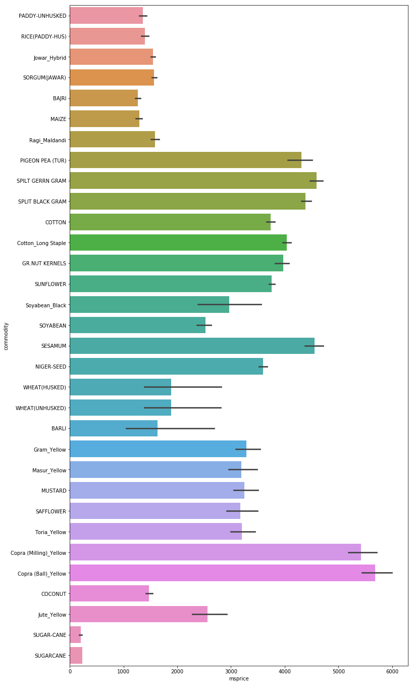
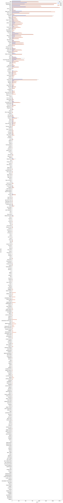

# Agriculture Commodities, Prices and Seasons
Aim: Your team is working on building a variety of insight packs to measure key trends in the Agriculture sector in India. You are presented with a data set around Agriculture and your aim is to understand trends in APMC (Agricultural produce market committee)/mandi price & quantity arrival data for different commodities in Maharashtra.

## Objectives
1. Test and filter outliers.
2. Understand price fluctuations accounting the seasonal effect
  i. Detect seasonality type (multiplicative or additive) for each cluster of APMC and commodities
  ii. De-seasonalise prices for each commodity and APMC according to the detected seasonality type
3. Compare prices in APMC/Mandi with MSP(Minimum Support Price)- raw and deseasonalised
4. Flag set of APMC/mandis and commodities with highest price fluctuation across different commodities in each relevant season, and year.

## Variable description
* msprice- Minimum Support Price
* arrivals_in_qtl- Quantity arrival in market (in quintal)
* min_price- Minimum price charged per quintal
* max_price- Maximum price charged per quintal
* modal_price- Mode (Average) price charged per quintal

## Submissions
1. Final cleaned file(s). (Bonus: if the files are shared using GitHub with well-versioned log)  
Check [Data_Cleaning.ipynb](./Data_Cleaning.ipynb)

2. Documentation around the methodology, analysis, and final results that you want to share with the Government of Maharashtra. Do use graphs and charts to substantiate your analysis. (Bonus- if you use GitHub pages / RPubs / etc. to share your documentation)  
See below.

2. Visualisations, if any. (Bonus - if you use interactive dashboards)  
See [Exploratory_Data_Analysis.ipynb](./Exploratory_Data_Analysis.ipynb)  
I have used interactive time series plots using plotly and cufflinks but it doesn't appear in the uploaded document here.

## Methodology
The methodology followed for this assignment was to first check for missing values in the data, rectifying them and creating new files with the changes. Next, the various plots have been there with respect to the MSP. After that, for the monthly data dataset, a plot of commodity vs. modal price has been plotted. Interactive visualations have also been done using plotly and cufflinks.

## Analysis
The plot of Commodity vs. the MSP

The plot of Commodity vs. Count of commodity produced

## Final Results
The price differences in the minimum price set by the Government and the actual price that the commoditites are sold for may be due to a few reasons, one of which can be that the transportation cost involved may be too high for select commoditites.

Thank You!
